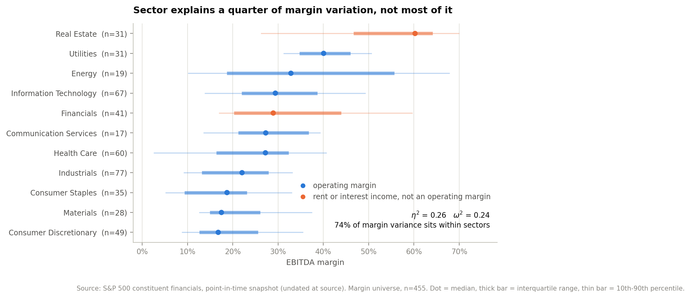
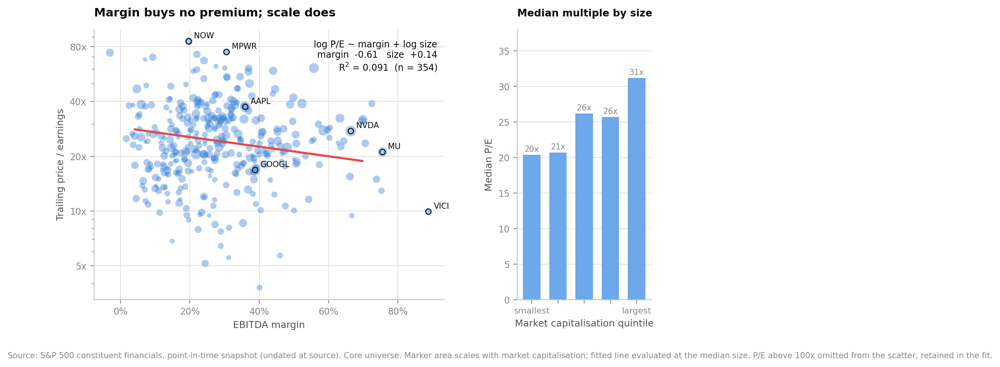
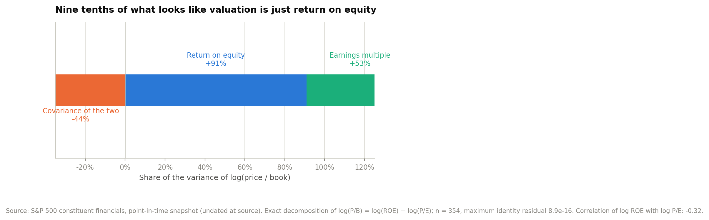
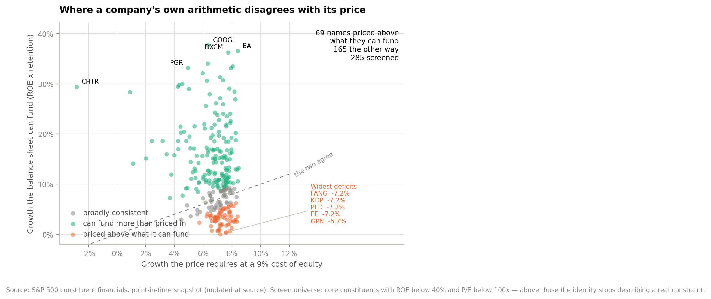
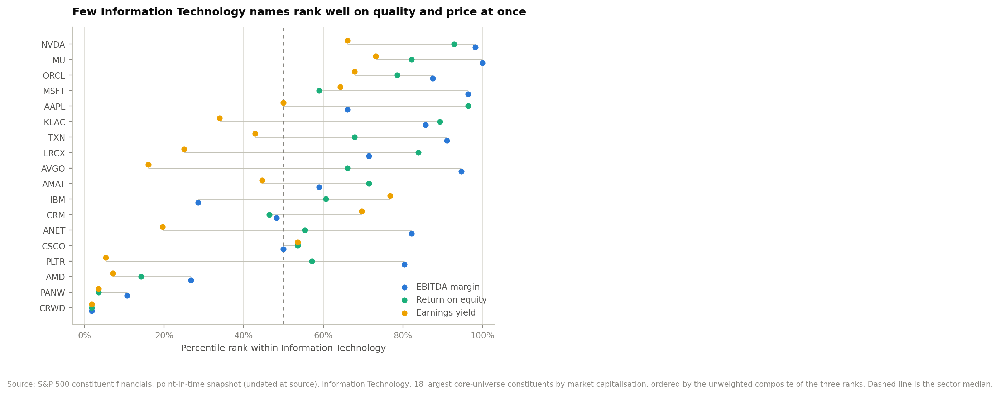
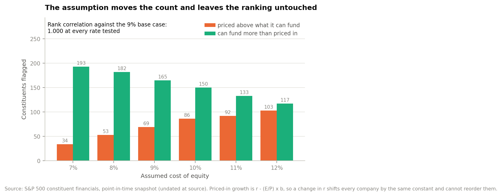

# S&P 500 profitability and valuation

An analysis of 503 index constituents built from a ratio-only extract: what the
index earns, how much of that is explained by what industry a company is in, and
whether the market pays anything for the difference.

The extract has no income statement and no balance sheet. Every fundamental here
is reconstructed from accounting identities — revenue from market cap and
price-to-sales, return on equity from price-to-book over price-to-earnings,
payout from dividend yield times price-to-earnings. The algebra is set out in
[`reports/technical-appendix.md`](reports/technical-appendix.md) and implemented
twice, in `src/derive.py` and again in `sql/01_staging.sql`.

The short version: **sector explains a quarter of the variation in margin, not
most of it**, and once banks and REITs are set aside it explains 15%. **The
market pays nothing for margin and something for size.** And nine tenths of what
looks like dispersion in the price-to-book multiple turns out to be dispersion in
return on equity rather than in valuation.

---

## Headline findings

| | |
|---|---|
| Constituents in the file / distinct companies | **503 / 483** |
| Core analysis universe | **354 companies, 85.1% of index market capitalisation** |
| Index market capitalisation | **$66.58 trillion** |
| Aggregate EBITDA margin / net margin | **22.7% / 14.7%** |
| Median return on equity | **18.1%** |
| Median trailing P/E (cap-weighted) | **24.2x (26.1x)** |
| Sector's share of EBITDA-margin variance | **η² = 0.26; 15% among operating companies** |
| Does a higher margin buy a higher multiple | **No — coefficient −0.61, R² 0.091** |
| Variance of log(P/B) that is return on equity | **91%** |
| Constituents priced above what they can fund | **69 of 285 screened, $4.2tn** |
| Of which Utilities | **21 of 29 screened utilities** |

## The five things that came out of it

**1. Sector explains a quarter of margin variation. The other three quarters sit
inside sectors.**

Sector medians run from 60.2% EBITDA margin for Real Estate down to 16.8% for
Consumer Discretionary — a 43-point range, which is what makes the sector story
feel obvious. But the effect size is η² = 0.26 (ω² = 0.24) on 455 companies:
statistically unambiguous (F = 15.7, p < 0.001) and much smaller than the range
of medians suggests. **74% of margin variance sits within sectors.** The median
sector's interquartile range is 15.6 points against 10.7 points across the sector
medians themselves, so knowing where a company sits inside its sector tells you
more about its margin than knowing which sector it is in.

Two of the eleven sectors are doing most of the remaining work, and neither
reports a margin that means what it appears to mean. A bank's revenue is interest
and fee income; a REIT's is rent against a depreciating asset base. Drop
Financials and Real Estate and the sector effect falls to **η² = 0.15** across the
383 operating companies.



Going one level finer does recover explanatory power — sub-industry reaches
η² = 0.59, ω² = 0.50 across 62 groups — but that is a statement about business
model, not about sector. Retail REITs and Managed Health Care are both "an
industry"; Industrials and Health Care are not.

**2. The market pays for size. It does not pay for margin.**

Regressing the log earnings multiple on EBITDA margin and log market
capitalisation gives a **negative** margin coefficient (−0.61, p = 0.002) and a
positive size coefficient (+0.14, p < 0.001) on an R² of 0.091. Holding size
constant, a company earning twenty points more EBITDA margin trades roughly 11%
*lower* on earnings. The size term survives eleven sector dummies (+0.13,
p < 0.001, R² 0.245); the margin term weakens but stays negative. Median trailing
P/E runs 20x, 21x, 26x, 26x, 31x across market-capitalisation quintiles — not a
clean ladder in the middle, but a decisive gap at the top.



EBITDA margin is the regressor because it is the only quality measure in this
extract that is not an algebraic rearrangement of the valuation multiples. ROE is
(P/B)/(P/E); net margin is (E/P)×(P/S). The naive specification — earnings yield
on ROE and net margin, which is what most people run first — returns
**R² = 0.002** with neither term significant. That is a genuine null, not an
artefact of the entanglement.

**3. Nine tenths of what looks like valuation dispersion is return on equity.**

Because ROE = (P/B)/(P/E), taking logs gives an exact identity:
log(P/B) = log(ROE) + log(P/E). Decomposing the variance across 354 companies:

| Component | Share of var[log(P/B)] |
|---|---|
| Variance of log ROE | **+91%** |
| Variance of log P/E | +53% |
| Covariance of the two | **−44%** |

The covariance term is the finding. Companies with higher returns on equity trade
on *lower* earnings multiples — correlation −0.32 between log ROE and log P/E —
so the market partly gives back on the earnings multiple what it pays on the book
multiple. A P/B ranking, which is how "the market pays for quality" is usually
demonstrated, is close to a ROE ranking with a valuation term subtracted from it.



**4. Sixty-nine companies are priced above the growth their own balance sheet can
fund, and most of them are utilities.**

Two growth numbers, both from the same accounts. What a company can fund without
issuing equity: ROE × retention. What the price requires at a 9% cost of equity
under a constant-payout Gordon model: r − (E/P) × b. Of 285 screened companies,
**69 sit more than two points below what their price needs and 165 sit above it**.

The deficit list has a clear mechanism rather than a mixed one. Its median payout
ratio is 66% against 22% for the surplus group, and its median ROE is 8.8%
against 21.2%. **Twenty-one of the 29 screened utilities are on it** — median
payout 65%, median ROE 9.6%, median gap −3.4 points, median dividend yield 3.3%.
These are not mispriced so much as structurally unable to compound: they
distribute what they earn, so the equity base barely grows, and the multiple is
carrying an expectation the earnings cannot meet from retained capital alone.



**5. In the largest sector, quality and price rarely arrive together.**

Information Technology is $24.6tn — 36.9% of index market capitalisation, 56
companies in the core universe. Ranking each on EBITDA margin, ROE and earnings
yield within the sector, only **10 of 56 clear the sector median on all three**:
NVDA, MU, ADBE, GEN, PTC, ORCL, MSFT, AAPL, NXPI and CSCO. Nineteen are cheap on
price alone: above the sector median on earnings yield but failing at least one
quality test, and ten of the nineteen fail both. That group is concentrated in IT
services and hardware distribution — Accenture, Cognizant, EPAM, CDW, Supermicro —
where the low multiple is a description of the business model rather than a
discount to it. Fifteen more are expensive without the quality to support it,
including three of the sector's largest names on more than 100x earnings.



## Recommendation

**Stop screening on sector for margin and screen on sub-industry or on the
company.** Sector is real (p < 0.001) and small (η² 0.26, and 0.15 once the two
non-operating sectors come out). A sector allocation built on the assumption that
margin is a sector property is buying a quarter of the effect it thinks it is
buying, and paying spread on the rest.

**Treat the high-payout deficit list as a funding problem, not a value
opportunity.** The 69 flagged companies are $4.2tn, 6.4% of index capitalisation,
and the utilities among them are the concentrated case: a 65% payout on a 9.6%
ROE funds 3.5 points of growth against the 6.8 the price requires. The
question to put to each is where the capital for the priced growth comes from —
rate base additions funded by issuance, or an expectation that will not be met.
The screen output is in `outputs/tables/growth_gap_extremes.csv`.

**Do not pay a quality premium on the earnings multiple, because the market is not
charging one.** The margin coefficient is negative and the size coefficient is
positive. Where a high-margin company also trades on a low multiple — the ten
Information Technology names above — that combination is available at no premium,
which is the only actionable part of the second finding.

The cost-of-equity assumption changes how many names are flagged and cannot
change which. Priced-in growth is r − (E/P)×b, so a change in r shifts every
company by the same constant: the deficit count moves from 34 at 7% to 103 at
12%, and the rank correlation against the base case is **1.000 at every rate
tested**.



## What the analysis assumes

Two parameters are not observable in the extract and are set in `src/config.py`.

**Cost of equity, 9%.** A long-run nominal required return on US large-cap
equity. Swept from 7% to 12% in `outputs/tables/cost_of_equity_sensitivity.csv`.
It moves the count of flagged companies and provably not the ranking.

**Terminal payout, 45%.** The long-run S&P 500 payout ratio, used to invert
Gordon. The shortcut g = r − E/P assumes full distribution and would make every
retaining company look as though the market demanded impossible growth from it.

Two judgement calls matter more than either parameter. Above a 40% return on
equity the sustainable-growth identity stops describing a real constraint —
sustained buybacks shrink book equity towards zero, so ROE rises without the
capacity to grow rising with it, and ROE × retention returns rates above 100%.
Sixty companies are set aside on that basis and reported separately. Above 100x
earnings the earnings yield is close to zero and the priced-in growth is pinned at
the cost of equity; nine more are set aside.

## Data quality, stated

The 503 rows become 483 distinct companies and then 354 in the core universe.
**Every removal is counted by rule** in `outputs/metrics.json` and listed row by
row in `outputs/tables/excluded_constituents.csv`. Nothing is dropped silently,
and nothing is dropped for being merely extreme — a company on 90x earnings is
expensive, not wrong.

Twenty rows go at the first stage: **17 carry no market data at all** and **3 are
junior share classes** of companies already in the file. The remaining 129 fail
one or more of the rules below. The counts overlap, because a row can fail
several at once.

- **28** have negative trailing earnings, so no earnings yield and no ROE
- **32** have negative book equity, which inverts the ROE identity
- **40** have a payout ratio above 1.0, which drives retention and growth negative
- **43** have no EBITDA — almost entirely banks and brokers, for whom it is not a
  meaningful measure
- **17** are missing a P/E despite being profitable, a plain vendor gap
- **4** carry a price-to-book above 250x, where E/B is numerically unstable

The negative-book cases are the interesting ones. They are McDonald's, Philip
Morris, Starbucks, Lowe's, HP, AutoZone, Domino's and 25 others: companies that
have repurchased more equity than they have retained. The ROE identity does not
fail on them because the data is bad. It fails because book equity has stopped
being a meaningful denominator, which is itself worth knowing before anyone
screens on ROE.

## Running it

```bash
make data      # fetch the source extract
make install
make analysis  # writes outputs/metrics.json, tables and figures
```

Every figure quoted above is written by `src/run_analysis.py` into
`outputs/metrics.json`. Nothing in this README is typed by hand.

## Repository layout

```
data/raw/            source extract (fetched, not committed)
data/processed/      derived analysis frame
sql/                 staging model with the derivations in SQL, plus assertions
src/                 sector mapping, derivations, screen, dispersion, valuation, figures
outputs/             metrics.json, tables, figures
reports/             executive summary and technical appendix
dashboard/           Tableau build guide and flat extracts
```

## Data

S&P 500 constituent financials published by the Frictionless Data project —
503 rows, 14 fields, one per index constituent. Fetched by `make data` from the
[source repository](https://github.com/datasets/s-and-p-500-companies-financials).

**This is a point-in-time snapshot and it carries no as-of date.** The publisher
overwrites the file in place and there is no date column, so the vintage has to
be inferred from the prices themselves. Nothing here should be read as a current
market level. There is one internal clue: 17 constituents carry no market data at
all, and several of them are companies that have left the index through
acquisition — Hess, Catalent and Marathon Oil among them — which means the
constituent roster and the price vector were assembled at different times.

The column labelled `Sector` is GICS **sub-industry**, not sector: 127 distinct
values across 503 rows. `src/sectors.py` rolls it up to the eleven GICS sectors
and raises on an unmapped value rather than defaulting it. Full provenance and
quirks: [`data/raw/README.md`](data/raw/README.md).

## Reading order

1. [`reports/executive-summary.md`](reports/executive-summary.md) — two pages, the position
2. This README — findings and evidence
3. [`reports/technical-appendix.md`](reports/technical-appendix.md) — derivations, method, limitations
4. [`dashboard/README.md`](dashboard/README.md) — the Tableau build

---

Lohan De Silva · [github.com/Lohandesilva](https://github.com/Lohandesilva) · MIT licensed
